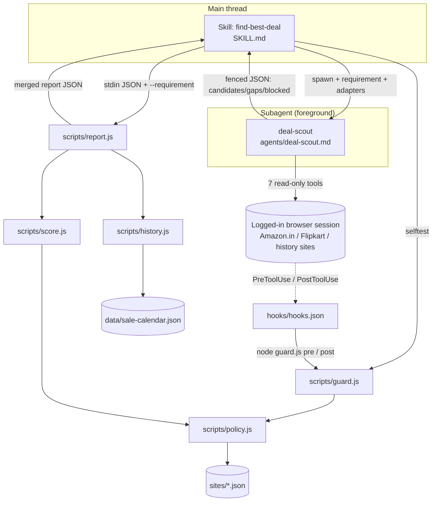

[← INDEX](INDEX.md)

# Architecture

## System purpose

A Claude Code plugin that answers "what is the best product and best deal for my requirement,
across Amazon.in and Flipkart, and should I buy now or wait?" It reads pages through the user's
own already-logged-in browser session and returns a ranked report. It cannot buy, cannot change
account state, cannot handle credentials, and cannot be steered by page content. India only.

Three design commitments drive everything below:

1. **The model extracts; deterministic scripts judge.** Ranking and the buy/wait verdict live in
   [`scripts/score.js`](../../scripts/score.js) and [`scripts/history.js`](../../scripts/history.js),
   never in model arithmetic. Same input → same answer.
2. **Read-only is mechanical, not instructional.** A hook
   ([`scripts/guard.js`](../../scripts/guard.js)) denies by default; the path allowlist is the
   control and the deny-list is defence in depth. See [security-and-permissions.md](security-and-permissions.md).
3. **Adding a site is adding a file.** `sites/*.json` is the extension point; no code change.
   See [site-adapters.md](site-adapters.md).

## Tech stack

| Layer | Choice | Version | Evidence |
|---|---|---|---|
| Runtime | Node.js, CommonJS (`"type": "commonjs"`, `'use strict'` per file) | "any recent version" — no engines field | [package.json](../../package.json), [README.md](../../README.md) install section |
| Dependencies | **none** — no `dependencies`, no `devDependencies`; only `node:` builtins (`node:fs`, `node:path`, `node:test`, `node:assert`) | — | [package.json](../../package.json), imports in [policy.js](../../scripts/policy.js#L13-L14) |
| Test framework | `node:test` + `node:assert` | — | [package.json](../../package.json), [test/](../../test) |
| Plugin manifest | Claude Code plugin + marketplace manifests | plugin `0.1.2` | [.claude-plugin/plugin.json](../../.claude-plugin/plugin.json), [marketplace.json](../../.claude-plugin/marketplace.json) |
| Browser access | The adapter-selected browser MCP tools, overlaid onto that browser's own logged-in session | — | [agents/deal-scout.md](../../agents/deal-scout.md#L4), [browsers/](../../browsers) |
| Hook integration | Claude Code `PreToolUse` / `PostToolUse` command hooks | — | [hooks/hooks.json](../../hooks/hooks.json) |

There is no build step, no bundler, no transpiler, and no CI. `python3` is deliberately *not*
used (on this machine it resolves to the Windows Store shim) — see plan §3.1 and
§9 "Alternatives considered".

## Components

### 1. Skill — entry point and orchestrator
[`skills/find-best-deal/SKILL.md`](../../skills/find-best-deal/SKILL.md) — invoked as
`/claude-deal-scout:find-best-deal`. Runs in the **main thread**. Owns preflight (guard selftest, and
confirming the tools the subagent's grant names are available), requirements intake, telling the user
to log in themselves, spawning the subagent in the *foreground*, invoking `report.js`, and presenting
the report.

**Invariant:** the main thread never drives the browser itself. The guard is scoped to the subagent's
`agent_type`, so a main-thread browser call is unguarded (residual risk R3 in
[docs/SECURITY.md](../../docs/SECURITY.md)).

### 2. Research subagent
[`agents/deal-scout.md`](../../agents/deal-scout.md) — frontmatter `name: deal-scout`, and a `tools:`
list of exactly the seven read-only tools of **one** shipped browser adapter and nothing else (no
Bash/Read/Write/WebFetch/WebSearch). The grant currently names `mcp__chrome-devtools__*`; the
alternative shipped adapter's names are drop-in.
Procedure: read the user's cart/wishlist/saved → search → open ≤5 products per site → extract a
fixed field set → history lookup → return one fenced JSON block
(`candidates` / `gaps` / `blocked`). Its prompt is the primary *instructional* control layer;
the guard is the mechanical one.

### 3. Guard hook
[`scripts/guard.js`](../../scripts/guard.js) wired by [`hooks/hooks.json`](../../hooks/hooks.json):

| Mode | Event | Matcher | Job |
|---|---|---|---|
| `pre` | `PreToolUse` | `mcp__.*` | deny a tool outside the configured read-only set, or a URL that fails policy → exit 2 |
| `post` | `PostToolUse` | `mcp__.*` | scan the response of a landing-checked tool for URLs; block if any host is off-allowlist (open-redirect catch) |
| `selftest` | (manual / skill preflight) | — | run the 60-case policy matrix; non-zero on any miss |

Scoping is inside the guard, not the matcher: `payload.agent_type !== AGENT_TYPE` (default
`"claude-deal-scout:deal-scout"`) returns allow unconditionally ([guard.js:32](../../scripts/guard.js#L32),
[:176](../../scripts/guard.js#L176)) — and the `run()` entry point returns **before either registry is
loaded**, so a broken `sites/` or `browsers/` cannot block another agent's call now that the matcher
fires on every MCP tool ([guard.js:315](../../scripts/guard.js#L315)).

### 4. Policy — the shared, pure decision layer
[`scripts/policy.js`](../../scripts/policy.js). No I/O beyond reading `sites/*.json` (the URL policy)
and `browsers/*.json` (which browser tools exist). Exports `checkTool(tool, browsers)`, `checkUrl`,
`loadSites`, `validateSites`, `loadBrowsers`, `validateBrowsers`, `sourceToBareId` and the vocabulary
constants. **Both** the hook and the scorer call in here — a mistake in this file is a mistake in
every layer ([policy.js:8-10](../../scripts/policy.js#L8-L10)).

### 5. Scorer / report validator
[`scripts/score.js`](../../scripts/score.js). Treats the agent's output as hostile data:
allowlisted fields only, strings capped at 300, numbers bounded at 10 000 000, every `url`
re-checked with `checkUrl`, free-text scrubbed for PII. Computes `effective_price`, `rating_adj`,
`flags`, `best_product`, `best_deal`, `product_groups`. Constants (`W_PRICE = 0.4`,
`W_RATING = 0.6`, `MIN_RATING = 3.5`, `PRIOR_MEAN = 4.0`, `PRIOR_N = 20`) are exported knobs.

### 6. History engine
[`scripts/history.js`](../../scripts/history.js). Validates the `history` sub-object, computes
`vs_average` / `vs_lowest` / `typical_low_window` / `next_dip_estimate`, and returns a verdict from
the fixed ladder `buy_now | wait | no_signal` with confidence `high | medium | low | none`.

### 7. Report CLI — the single deterministic entry point
[`scripts/report.js`](../../scripts/report.js). Reads the agent's JSON on stdin, takes
`--requirement <json>`, calls `score()` and `analyzeAll()` **independently over the same raw
candidate array** (neither feeds the other), and re-joins them on `candidate.index` so they stay
aligned even when validation drops candidates ([report.js:34-50](../../scripts/report.js#L34-L50)).

### 8. Data
`sites/*.json` (site adapters), `browsers/*.json` (browser tool registry) and
`data/sale-calendar.json` (8 approximate Indian sale windows, `{name, months[]}`). All three are
data so that a new site, a new browser or a shifted sale window is a JSON edit.

## Cross-cutting concerns

| Concern | How it works here | Evidence |
|---|---|---|
| **Enablement / gating** | Default-deny tool allowlist (from `browsers/*.json`) + per-site path allowlist (from `sites/*.json`, matched in `policy.js`); the tool allowlist is consumed by the hook, the path allowlist by both the hook (enforcement) and the scorer (report re-check) | [browsers/](../../browsers), [policy.js:110-114](../../scripts/policy.js#L110-L114) |
| **Failure policy** | **Fail closed.** Any throw, unparseable stdin, or broken adapter → exit 2 (which is what blocks a tool call; every other non-zero exit fails open). `guard.js` catches everything on purpose ([guard.js:181-184](../../scripts/guard.js#L181-L184), [:323-331](../../scripts/guard.js#L323-L331)) | [docs/SECURITY.md](../../docs/SECURITY.md) R1 |
| **Error handling** | Plain `Error` with a message naming the file and the problem (`sites/x.json: "allow" must be …`). `report.js` returns exit 2 with a stderr message rather than printing a partial report | [policy.js:165-167](../../scripts/policy.js#L165-L167), [report.js:86-89](../../scripts/report.js#L86-L89) |
| **Logging / observability** | No logger and no `console.*`. Hooks write the block reason to **stderr**; the PostToolUse decision goes to **stdout** as JSON. `report.js` prints the report to stdout, errors to stderr | [guard.js:64-66](../../scripts/guard.js#L64-L66), [:318](../../scripts/guard.js#L318) |
| **Config** | `CLAUDE_PLUGIN_ROOT` for path resolution in the skill's shell commands; `DEAL_SCOUT_SITES_DIR` / `DEAL_SCOUT_BROWSERS_DIR` override the two registries (**test seams only**); `DEAL_SCOUT_AGENT_TYPE` overrides the scope (a portability seam, not a knob) | [guard.js:32](../../scripts/guard.js#L32), [:56-60](../../scripts/guard.js#L56-L60), [build-and-run.md](build-and-run.md) |
| **Persistence** | **None.** The plugin writes nothing to disk by design (R9 in plan §2). The only file it touches is the temp file the skill writes from the agent's stdout to feed `report.js` | plan §2 R9, [SKILL.md](../../skills/find-best-deal/SKILL.md) step 4 |
| **Output trust boundary** | Agent JSON → validated as untrusted data → report; the skill treats the report as data too | [score.js:5-10](../../scripts/score.js#L5-L10) |

## Component diagram

## External integrations

| External thing | Role | Wired in at | If it is unavailable |
|---|---|---|---|
| The granted adapter's browser MCP tools — `mcp__chrome-devtools__*` under the adapter the subagent is currently granted, `mcp__claude-in-chrome__*` / `mcp__Claude_Browser__*` under the other shipped one (both in [browsers/](../../browsers)) | the only way the plugin sees a page | subagent `tools:` frontmatter; the `browsers/` registry (the hook matcher is `mcp__.*`) | skill preflight stops the run and tells the user to install/enable the browser the registry names |
| `www.amazon.in` / `amazon.in`, `www.flipkart.com` / `flipkart.com` | shop adapters | [sites/amazon-in.json](../../sites/amazon-in.json), [sites/flipkart.json](../../sites/flipkart.json) | adapter invalid → guard fails closed (run stops, nothing proceeds) |
| Price-history sites | `kind: "history"` adapters → `urls.lookup` | **no adapter ships today** | `history` key omitted per candidate, one aggregated gap note, verdict `no_signal` |
| Node.js binary | runs the hook and the scripts | hook `command` strings, skill preflight | guard selftest preflight fails → skill stops (this is the one failure the hook cannot cover) |

The plugin opens **no** network sockets of its own — the browser does all the talking
([docs/SECURITY.md](../../docs/SECURITY.md) "What the plugin can and cannot do").

## Known structural gap

**Price history (requirement R10) is inert end-to-end.** No `sites/<history-site>.json` exists, so
`loadSites` returns shop adapters only, the agent finds no applicable history adapter, and
`history.js` never sees input. The documented, deliberate degradation is: omit `history`, add a
"no price history found" gap note, verdict `no_signal` — never invent a pattern. The survey
findings and the open decisions are in
[`.beads/DS-1/evidence-04.txt`](../../.beads/DS-1/evidence-04.txt); the design is complete and
tested, the data source is what is missing.
