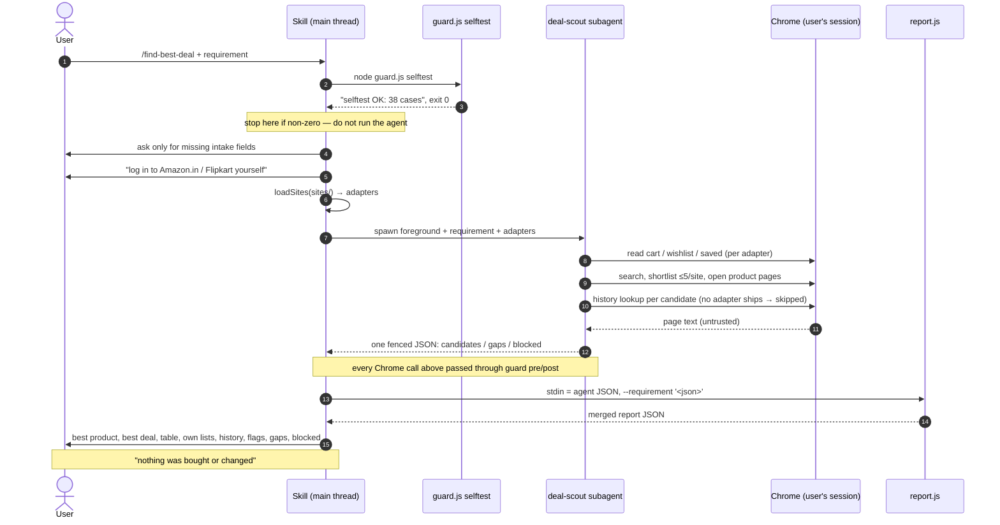
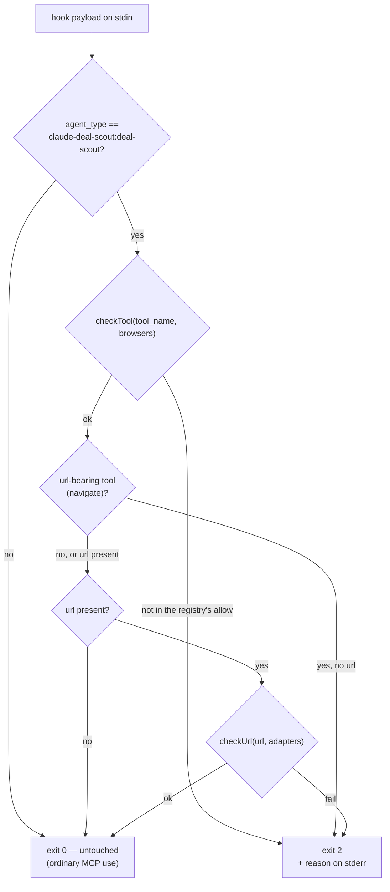
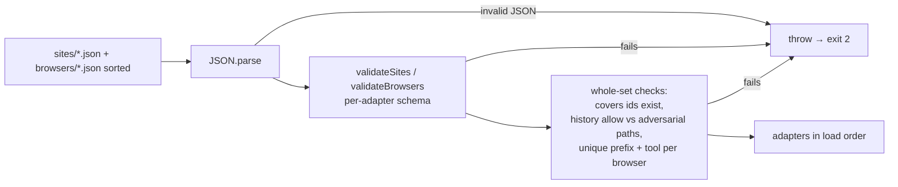
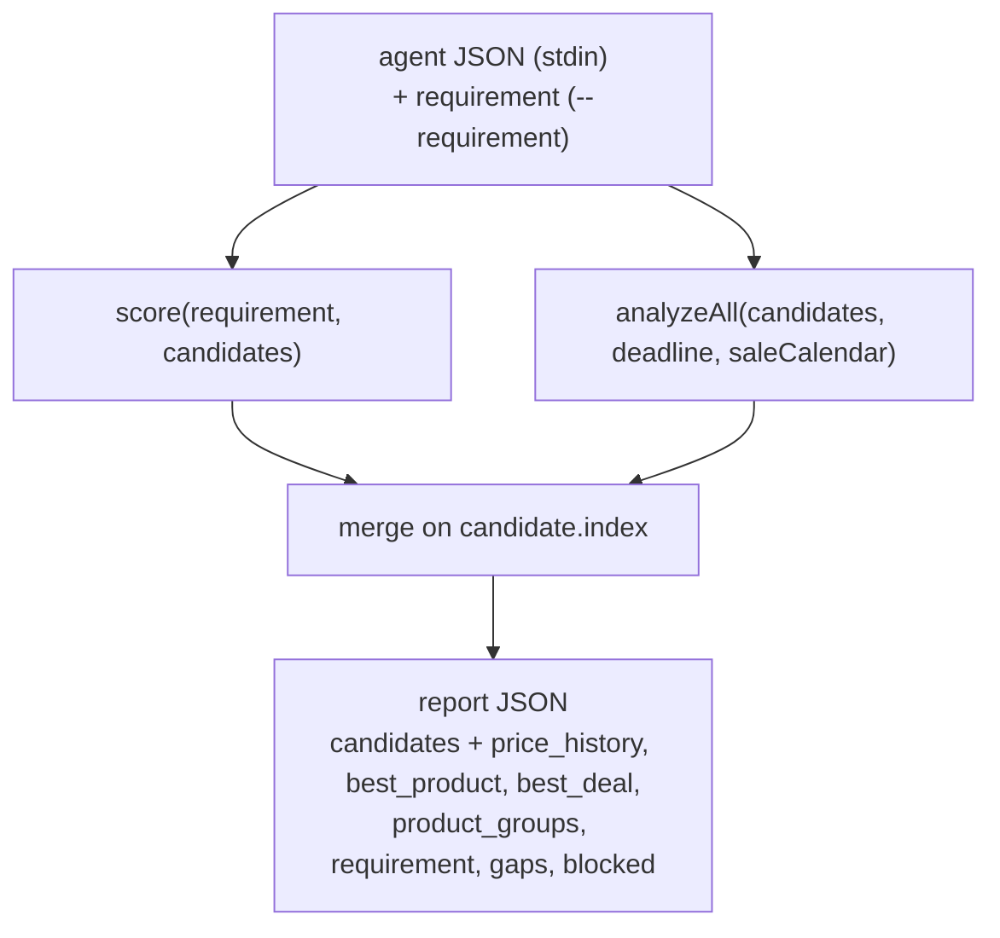
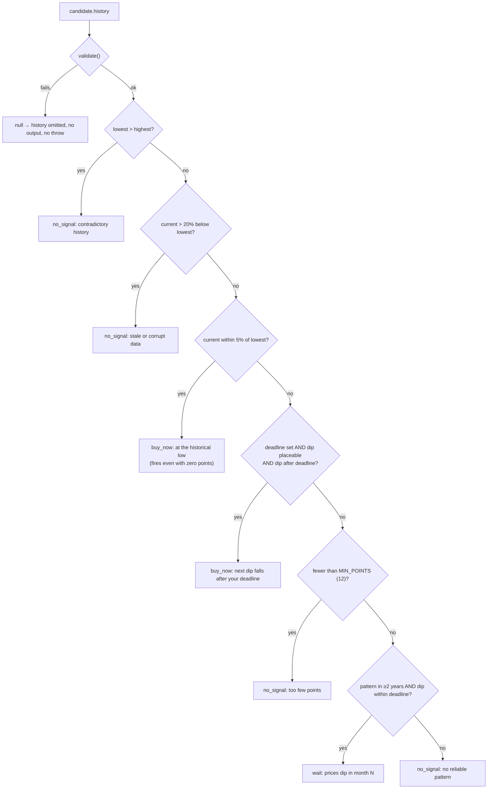

[← INDEX](INDEX.md)

# Workflows

Six flows. There are **no retries anywhere** in this plugin, and no transaction boundaries — nothing
is written, so every flow is idempotent and a re-run is always safe. Where a step fails, the design
choice is always "stop loudly" or "degrade honestly", never "retry" or "guess".

## 1. A full `find-best-deal` run

Entry point: the user invokes `/claude-deal-scout:find-best-deal`. Owner: the **main thread**, which
orchestrates but never touches Chrome ([SKILL.md](../../skills/find-best-deal/SKILL.md)).



**Failure modes:** an unavailable Claude-in-Chrome tool or a failed selftest stops the run before
the agent starts. A sign-in wall becomes a `login_required` gap and the run continues public-only. A
CAPTCHA becomes a `blocked` entry; the agent skips that page and continues — and the **main thread
must not retry it**. Malformed agent JSON exits 2 and is reported as-is; the skill must not
hand-edit it into shape, because the validation that follows is also the injection control.

**Idempotency:** fully read-only on the sites, deterministic in the scripts — the same agent output
and the same requirement always produce byte-identical report JSON.

## 2. Guard `PreToolUse` — the enforcement path

[`evaluatePre`, guard.js:91-112](../../scripts/guard.js#L91-L112). Runs before *every* browser tool
call the subagent attempts.



Note the order: the tool is checked first, then the URL. A URL is checked whenever one is present,
**even on a tool that does not normally carry one** — so `navigate` and a hypothetical `read_page`
with a `url` are treated alike. Any throw — unparseable stdin, a broken adapter, anything — is
caught and becomes exit 2 ([:181-184](../../scripts/guard.js#L181-L184)).

## 3. Guard `PostToolUse` — the redirect catch

[`evaluatePost`, guard.js:134-165](../../scripts/guard.js#L134-L165). `navigate`'s response echoes
only the *requested* URL, so the landed URL has to be read from a `tabs_context_mcp` listing.
`evaluatePost` first gates on the registry's `landing_check` set — it scans a tool's response only
when the tool is positively identified as landing-checked, which is what keeps a link-dense
`read_page` response from blocking every read.

```mermaid
sequenceDiagram
  participant A as subagent
  participant N as navigate
  participant H as guard post
  participant T as tabs_context_mcp

  A->>N: navigate(url)
  N-->>A: echoes the REQUESTED url only
  A->>T: tabs_context_mcp (required by the agent prompt)
  T-->>H: response containing the real tab URLs
  H->>H: walk response for http(s):// strings
  alt any host off-allowlist
    H-->>A: {"decision":"block", reason: discard the page, close the tab}
  else all allowlisted
    H-->>A: (nothing; exit 0)
  end
```

**Residual (R2):** this whole layer depends on the agent actually making the
`tabs_context_mcp` call, and on the landed URL appearing in a response. It is an after-the-fact
check, never independent of agent behaviour. See [docs/SECURITY.md](../../docs/SECURITY.md).

## 4. Registry load & validation (fail closed)

Runs on every `report.js` run (`sites/` only) and on every **in-scope** guard invocation (both
`sites/` and `browsers/`). The guard loads the registries only *after* the `agent_type` scope check,
so an out-of-scope MCP call never touches one
([guard.js:315-317](../../scripts/guard.js#L315-L317), [report.js:82](../../scripts/report.js#L82)).



This is the plugin's fail-closed posture in one picture: **a bad adapter stops the run** rather than
proceeding with a policy you did not intend. If the plugin suddenly refuses everything after a
`sites/` or `browsers/` edit, the adapter is the first suspect. Details in
[site-adapters.md](site-adapters.md); the browser registry's own checks are at
[policy.js:328-384](../../scripts/policy.js#L328-L384).

## 5. Report pipeline — validate, rank, history, merge

Entry: `node scripts/report.js --requirement <json> < agent-output.json`. The key structural fact is
that **`score.js` and `history.js` both receive the agent's raw candidate array; neither feeds the
other**, and their outputs are re-joined on `candidate.index` because validation may drop candidates
and the two arrays are therefore not positionally aligned
([report.js:34-50](../../scripts/report.js#L34-L50)).



Inside `score()`: per-candidate validation (drop unknown fields, cap strings, bound numbers,
`checkUrl` the URL, sanitize PII, enforce the `must_haves_reason` invariant) → `effective_price` and
`rating_adj` → flags → must-haves gate → min–max normalised score → `best_product`; then a separate
filter for `best_deal` (must-haves **and** `rating_adj ≥ MIN_RATING` **and** budget) sorted by
`effective_price`. Ties break lexicographically on `source`, then on array index
([score.js:292-382](../../scripts/score.js#L292-L382)).

**Failure mode:** malformed stdin or a bad `--requirement` exits 2 on stderr. A partial report is
never printed — deliberate, because the validation is also the injection control.

## 6. Price-history verdict

Owner: [`decide()`, history.js:230-278](../../scripts/history.js#L230-L278). The rungs are evaluated
**in a fixed order and the order is the contract** — (2a) must be reachable on summary-only input,
and the point-count gate must never be able to block it.



No deadline → rungs (2b) and (4) are skipped entirely; (2a) and the data-quality gates are
unaffected. Confidence is derived from the `typical_low_window` label plus sale-calendar overlap
([confidenceFor](../../scripts/history.js#L130-L134)). Every result carries the `caveat` string.

**Retries:** none — thin or contradictory data returns `no_signal` rather than a guess, and that is
documented as a real answer rather than a failure.

### Status of this flow today

**It never runs.** No history adapter ships, so no candidate ever carries a `history` key, every
call returns `null`, and the report shows a "no price history found" gap. The engine is fully
implemented and pinned by 30-odd tests; only the data source is missing —
[site-adapters.md](site-adapters.md#no-history-adapter-ships-today).
